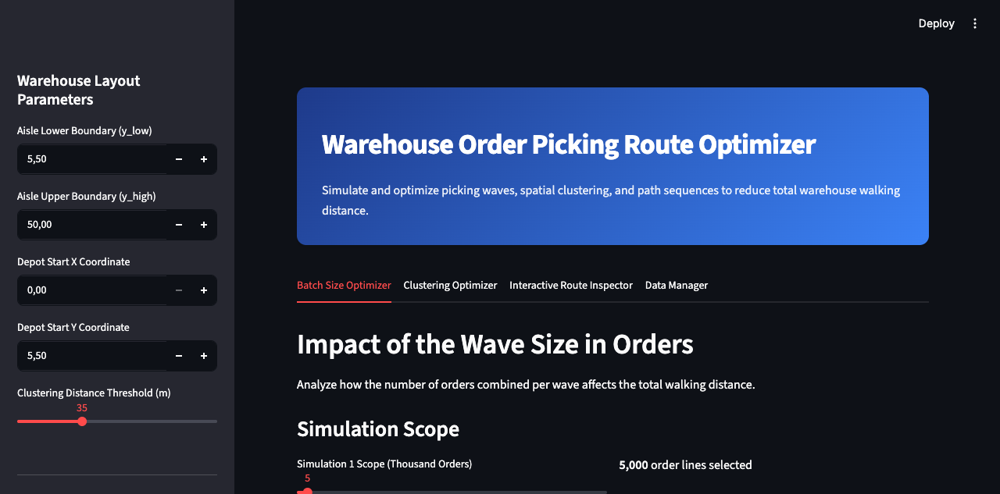
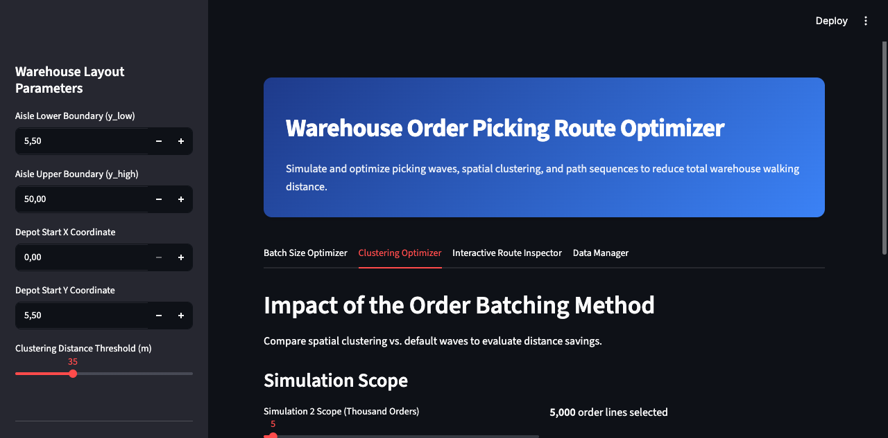
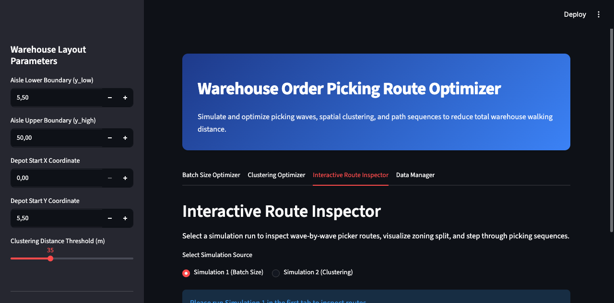
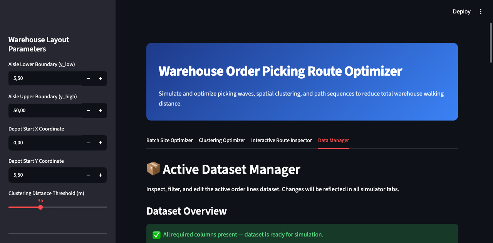

# Warehouse Picking Route Optimizer - Enhanced Fork 📦

This repository is an enhanced fork of Samir Saci's original warehouse order batching and picking route optimisation project. The original work provides the modelling foundation, article references, sample dataset structure, and baseline Streamlit application.

This fork extends the application into a richer Streamlit analytics dashboard with updated routing options, dataset validation, trolley constraints, multi-picker assignment, zone picking, route inspection, and active dataset management.

In a **Distribution Centre (DC)**, walking time between locations during the picking route can account for 60%-70% of an operator’s working time. Reducing this walking time is the most effective way to increase your DC overall productivity.

<p align="center">
  <a href="https://www.samirsaci.com/improve-warehouse-productivity-using-order-batching-with-python/" target="_blank" rel="noopener noreferrer">
    
  </a>
</p>
<p align="center"><b>Scenario 1:</b> Picking routes with 1 order picked per wave</p>>


Samir Saci published a series of articles proposing an approach to design a model that simulates the impact of multiple picking processes and routing methods to identify optimal order picking using the Single Picker Routing Problem (SPRP) for a two-dimensional warehouse model (axis-x, axis-y).

SPRP is a specific application of the general **Travelling Salesman Problem (TSP)** answering the question:

>  “Given a list of storage locations and the distances between each pair of locations, what is the shortest possible route that visits each storage location and returns to the depot ?”

This enhanced fork contains a ready-to-use **Streamlit App** designed for **Logistics Engineers** to test these strategies by uploading their own order line records, configuring warehouse constraints, and comparing routing and batching scenarios.

## Fork enhancements

Compared with the original baseline application, this fork adds:

- A multi-tab Streamlit dashboard with KPI cards and route inspection workflows.
- CSV upload, schema validation, and active dataset management.
- OR-Tools TSP routing as an alternative to the greedy next-closest-location heuristic.
- Independent wave range controls for batch and clustering simulations.
- Trolley capacity constraints by total pieces and order lines.
- Optional X-axis zone picking and multi-picker wave assignment.
- Route inspector filters by simulation, clustering method, wave size, zone, picker, and wave ID.
- Process-pool fallback behavior for restricted environments where multiprocessing is not available.

### Original theory and references 📜
- Improve Warehouse Productivity using Order Batching with Python - [Article](https://www.samirsaci.com/improve-warehouse-productivity-using-order-batching-with-python/)
- Improve Warehouse Productivity using Spatial Clustering with Python Scipy - [Article](https://www.samirsaci.com/improve-warehouse-productivity-using-spatial-clustering-with-python/)
- Design Pathfinding Algorithm using Google AI to Improve Warehouse Productivity - [Article](https://www.samirsaci.com/improve-warehouse-productivity-using-pathfinding-algorithm-with-python/)


# Picking Route Optimisation 🚶‍♂️ 

## 💾 **Initial: prepare order lines datasets with picking locations**

Based on your **actual warehouse layout**, storage locations are mapped with **2-D (x, y) coordinates** that will be used to measure walking distance.

<p align="center">
  <a href="https://www.samirsaci.com/improve-warehouse-productivity-using-order-batching-with-python/" target="_blank" rel="noopener noreferrer">
    
  </a>
</p>
<p align="center">Warehouse Layout with 2D Coordinates</p>

Every storage location must be linked to a Reference using Master Data. (For instance, reference #123129 is located in coordinate (xi, yi)). You can then associate every order line to a geographical location for picking.

<p align="center">
  <a href="https://www.samirsaci.com/improve-warehouse-productivity-using-order-batching-with-python/" target="_blank" rel="noopener noreferrer">
    
  </a>
</p>
<p align="center">Database Schema</p>

Order lines can be extracted from your WMS Database. This table should be joined with the Master Data table to link each order line to a storage location and specify its (x, y) coordinates in your warehouse. Extra tables can be added to include more parameters in your model, like (Destination, Delivery lead time, Special Packing, ..).

## 🧪 **Experiment 1: Impacts of wave picking on the pickers' walking distance?**
_For more information and details about calculation: [Medium Article](https://medium.com/towards-data-science/optimizing-warehouse-operations-with-python-part-1-83d02d001845)_

### ✔️ Problem Statement

For this study, we will use an E-Commerce-type DC where items are stored on 4-level shelves. These shelves are organized in multiple rows (Row#: 1 … n) and aisles (Aisle#: A1 … A_n).

<p align="center">
  <a href="https://www.samirsaci.com/improve-warehouse-productivity-using-order-batching-with-python/" target="_blank" rel="noopener noreferrer">
    
  </a>
</p>
<p align="center">Different routes between two storage locations in the warehouse</p>

1. Item Dimensions: Small and light dimensions of items
2. Picking Cart: lightweight picking cart with a capacity of 10 orders
3. Picking Route: Picking Route starts and ends at the exact location

Scenario 1, the worst in terms of productivity, can be easily optimised because of
- Locations: Orders #1 and #2 have common picking locations
- Zones: orders have picking locations in a common zone
- Single-line Orders: items_picked/walking_distance efficiency is very low

<p align="center">
  <a href="https://www.samirsaci.com/improve-warehouse-productivity-using-order-batching-with-python/" target="_blank" rel="noopener noreferrer">
    
  </a>
</p>
<p align="center"><b>Scenario 2:</b> Wave Picking applied to Scenario 1</p>

The first intuitive way to optimise this process is to combine these three orders into a single picking route — a strategy commonly called Wave Picking.

We will build a model to simulate the impact of several wave-picking strategies on the total walking distance for a specific set of orders.


### 📊 Simulation 
In the article, I have built a set of functions needed to run different scenarios and simulate the picker's walking distance.

**Function:** Calculate the distance between two picking locations
<p align="center">
  <a href="https://www.samirsaci.com/improve-warehouse-productivity-using-order-batching-with-python/" target="_blank" rel="noopener noreferrer">
    
  </a>
</p>
<p align="center"><b>Function:</b> Different routes between two storage locations in the warehouse</p>

This function calculates the walking distance between points i (xi, yi) and j (xj, yj).

Objective: return the shortest walking distance between the two potential routes from point i to point j.
> Parameters
- y_low: lowest point of your alley (y-axis)
- y_high: highest point of your alley (y-axis)

**Function:** The Next Closest Location
<p align="center">
  <a href="https://www.samirsaci.com/improve-warehouse-productivity-using-order-batching-with-python/" target="_blank" rel="noopener noreferrer">
    
  </a>
</p>
<p align="center"><b>Function:</b> Next Storage Location Scenario</p>

This function will choose the next location among several candidates to continue your picking route.

Objective: return the closest location as the best candidate

This function will create your picking route from a set of orders to prepare.
- Input: a list of (x, y) locations based on items to be picked for this route
- Output: an ordered sequence of locations covered and total walking distance

**Function:** Create batches of n orders to be picked at the same time
- Input: order lines data frame (df_orderlines), number of orders per wave (orders_number)
- Output: data frame mapped with wave number (Column: WaveID), the total number of waves (waves_number)

**Function:** listing picking locations of wave_ID picking route
- Input: order lines data frame (df_orderlines) and wave number (waveID)
- Output: list of locations i(xi, yi) included in your picking route

### ☑️ **Results and Next Steps**

After setting up all necessary functions to measure picking distance, we can now test our picking route strategy with picking order lines.

Here, we first decided to start with a very simple approach
- Orders Waves: orders are grouped by chronological order of receiving time from OMS ( TimeStamp)
- Picking Route: The picking route strategy follows the Next Closest Location logic

To estimate the impact of wave picking strategy on your productivity, we will run several simulations with a gradual number of orders per wave:
1. Measure Total Walking Distance: how much walking distance is reduced when the number of orders per route is increased?
2. Record Picking Route per Wave: recording the sequence of locations per route for further analysis

<p align="center">
  <a href="https://www.samirsaci.com/improve-warehouse-productivity-using-order-batching-with-python/" target="_blank" rel="noopener noreferrer">
    
  </a>
</p>
<p align="center"><b>Experiment 1:</b> Results for 5,000 order lines with a ratio from 1 to 9 orders per route</p>

## 🧮**Experiment 2: Impacts of orders batching using spatial clusters of picking locations?**
_For more information and details about calculation: [Article](https://medium.com/towards-data-science/optimizing-warehouse-operations-with-python-part-2-clustering-with-scipy-for-waves-creation-9b7c7dd49a84)

<p align="center">
  <a href="https://www.samirsaci.com/improve-warehouse-productivity-using-order-batching-with-python/" target="_blank" rel="noopener noreferrer">
    
  </a>
</p>
<p align="center"><b>Order Lines Processing</b> for Order Wave Picking using Clustering by Picking Location</p>

### 💡**Idea: Picking Locations Clusters** ###

Group picking locations by clusters to reduce the walking distance for each picking route. _(Example: the maximum walking distance between two locations is <15 m)_

Spatial clustering is the task of grouping together a set of points in a way that objects in the same cluster are more similar to each other than to objects in other clusters.

For this part we will split the orders in two categories:
- Mono-line orders: they can be associated to a unique picking locations 
- Multi-line orders: that are associated with several picking locations

#### **Mono-line orders** 
<p align="center">
  <a href="https://www.samirsaci.com/improve-warehouse-productivity-using-order-batching-with-python/" target="_blank" rel="noopener noreferrer">
    
  </a>
</p>
<p align="center">Left [Clustering using Walking Distance] / Right [Clustering using Euclidian Distance]</p>

_Grouping orders in cluster within n meters of walking distance_

#### **Multi-line orders** 
<p align="center">
  <a href="https://www.samirsaci.com/improve-warehouse-productivity-using-order-batching-with-python/" target="_blank" rel="noopener noreferrer">
    
  </a>
</p>
<p align="center"><b>Example: </b>Centroid of three Picking Locations</p>

_Grouping multi-line orders in cluster (using centroids of picking locations) within n meters of walking distance_


### 🐁 **Model Simulation** ###

#### **Methodology** 

To sum up, our model construction, see the chart below, we have several steps before Picking Routes Creation using Wave Processing.

At each step, we have a collection of parameters that can be tuned to improve performance:
<p align="center">
  <a href="https://www.samirsaci.com/improve-warehouse-productivity-using-order-batching-with-python/" target="_blank" rel="noopener noreferrer">
    
  </a>
</p>
<p align="center"><b>Methodology: </b>Model Construction with Parameters</p>

#### **Comparing three methods of wave creation**
<p align="center">
  <a href="https://www.samirsaci.com/improve-warehouse-productivity-using-order-batching-with-python/" target="_blank" rel="noopener noreferrer">
    
  </a>
</p>
<p align="center"><b>Methodology: </b>Three Methods for Wave Processing</p>

We’ll start first by assessing the impact of Order Wave processing by clusters of picking locations on total walking distance.

We’ll be testing three different methods:
- Method 1: we do not apply clustering (i.e Initial Scenario)
- Method 2: we apply clustering on single-line orders only
- Method 3: we apply clustering to single-line orders and centroids of multiline orders

#### **Parameters of Simulation**
- Order lines: 20,000 Lines
- Distance Threshold: Maximum distance between two picking locations _(distance_threshold = 35 m)_
- Orders per Wave: orders_number in [1, 9]

#### **Final Results**
<p align="center">
  <a href="https://www.samirsaci.com/improve-warehouse-productivity-using-order-batching-with-python/" target="_blank" rel="noopener noreferrer">
    
  </a>
</p>
<p align="center"><b>Test 1:</b> 20,000 Order Lines / 35 m distance Threshold</p>

- Best Performance: Method 3 for 9 orders/Wave with 83% reduction of walking distance
- Method 2 vs. Method 1: Clustering for mono-line orders reduce the walking distance by 34%
- Method 3 vs. Method 2: Clustering for mono-line orders reduce the walking distance by 10%

# Build the application locally 🏗️

The current version is a Streamlit dashboard for local warehouse picking simulation. It supports wave-size optimisation, spatial clustering, trolley constraints, optional zone picking, multi-picker route assignment, OR-Tools TSP routing, CSV upload, and active dataset inspection.

## Requirements

- Python 3.14 is used in the included `.venv`.
- Dependencies are pinned in `requirements.txt`.
- The default sample dataset is `static/in/df_lines.csv`.

## Quick start

If the repository already contains the local virtual environment:

```bash
./.venv/bin/streamlit run app.py
```

Then open:

```text
http://localhost:8501
```

If you need to create a fresh environment:

```bash
python3 -m venv .venv
source .venv/bin/activate
pip install -r requirements.txt
streamlit run app.py
```

For remote or container usage, expose Streamlit explicitly:

```bash
streamlit run app.py --server.address 0.0.0.0
```

## CSV input format

Custom uploaded CSV files are validated before simulation. Required columns:

| Column | Description | Example |
| --- | --- | --- |
| `DATE` | Order date or timestamp used for chronological wave mapping | `12/11/2018` |
| `OrderNumber` | Order identifier | `3780678` |
| `SKU` | Item/reference identifier per order line | `399573` |
| `PCS` | Piece quantity per order line | `1` |
| `Coord` | Picking coordinate as a stringified 2D list | `"[19.5, 21.0]"` |

Coordinates should match the warehouse coordinate system configured in the sidebar. When zone picking is enabled, the X value in `Coord` is used to split order lines into zones.

# Use the application 🖥️

## Application screenshots

### Batch Size Optimizer



### Clustering Optimizer



### Interactive Route Inspector



### Data Manager



## Sidebar controls

- **Warehouse Layout Parameters**: configure aisle lower/upper Y boundaries and depot coordinates.
- **Clustering Distance Threshold**: sets the maximum walking-distance threshold for spatial clustering.
- **Trolley Capacity Constraints**: optionally limit wave size by max pieces (`PCS`) and max order lines.
- **Multi-Picker & Zoning Options**:
  - Enable zone picking with an X-coordinate split.
  - Select the number of pickers for disjoint wave assignment.
- **Dataset Upload**: upload a validated WMS order-line CSV.
- **Routing Algorithm**:
  - `Google OR-Tools (TSP)` for route optimisation.
  - `Next Closest Location (Greedy)` for faster heuristic routing.

## Dashboard tabs

### 1. Batch Size Optimizer

Simulates chronological order batching across a configurable range of orders per wave.

- Choose simulation scope in thousands of order lines.
- Set independent `N_MIN` and `N_MAX` values.
- Compare total walking distance by wave size.
- Review KPIs for optimal wave size, minimum distance, and selected routing algorithm.
- Supports trolley limits, optional X-zone splitting, and multi-picker assignment.

### 2. Clustering Optimizer

Compares three wave creation strategies:

- **Method 1**: no clustering (`normal-normal`).
- **Method 2**: clustering single-line orders only (`clustering-normal`).
- **Method 3**: clustering single-line orders and multi-line order centroids (`clustering-clustering`).

The optimizer reports the best clustered wave size, minimum clustered distance, and distance savings versus the no-clustering baseline. Simulation 2 has its own independent `N_MIN` and `N_MAX` controls.

### 3. Interactive Route Inspector

Inspect saved routes from Simulation 1 or Simulation 2.

- Filter by wave size, clustering method, zone, picker, and wave ID.
- View route KPIs for selected wave, zone, picker, distance, and pick count.
- Display the full numbered route or step through the sequence interactively.
- The route view shows warehouse aisles, racks, depot, direction arrows, picked locations, pending locations, and optional zone split line.

### 4. Data Manager

Inspect and validate the active dataset used by the simulations.

- View row count, unique orders, unique SKUs, total pieces, and missing values.
- Confirm required simulation columns are present.
- Explore pick-location density heatmaps.
- Review piece quantity distribution and orders per date.
- Uploaded datasets are stored in Streamlit session state and reused by simulator tabs.

## Execution behavior

The simulation engine tries to use `ProcessPoolExecutor` with a small worker cap for faster multi-core execution. If the runtime does not allow multiprocessing, the app automatically falls back to sequential execution instead of failing. This is useful for restricted local shells, hosted notebooks, and some sandboxed environments.

## Credits and attribution

This project is based on the original warehouse productivity and order batching work by **Samir Saci**.

Original resources:

- Original article series and methodology: [samirsaci.com](https://samirsaci.com)
- Original consulting reference: [Logigreen Consulting](https://www.logi-green.com/)

This fork keeps the original modelling context and references while adding new application features, UI improvements, routing options, validation, zoning, multi-picker workflows, and dataset management.

If you publish this fork publicly, keep this attribution section so the original work remains clearly credited.
